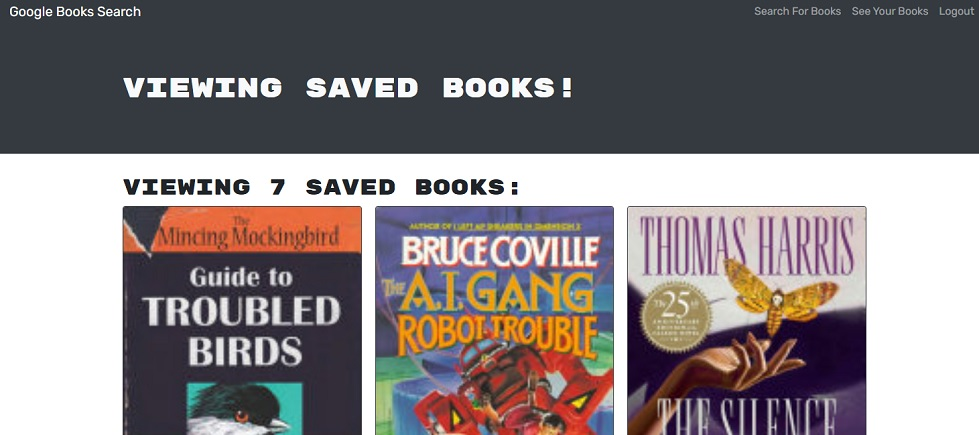

# Google Book Search - React Pathway

This project is a full stack application that gives users the ability to save a list of books available via the Google Books API.

Check it out here: [Google Book Search](https://book-search-dmueller.herokuapp.com)

## What does it do?
- Users may create accounts using a username, email address, and password.
- Users can log in to save books to their own book list, view books in their own list, and remove books from the list.
- Users can search for books.

## Tools/Technologies
- Back end - Node.js, GraphQL using Apollo Server, MongoDB, Mongoose.js
- Front end - React.js, React Bootstrap, GraphQL with Apollo Boost
- Data served from the [Google Books API](https://developers.google.com/books)

## Project Scope
Working code was provided for this project, with the back end serving a REST API, and the front end consuming that API. The code was refactored to replace the REST API with a GraphQL API.
